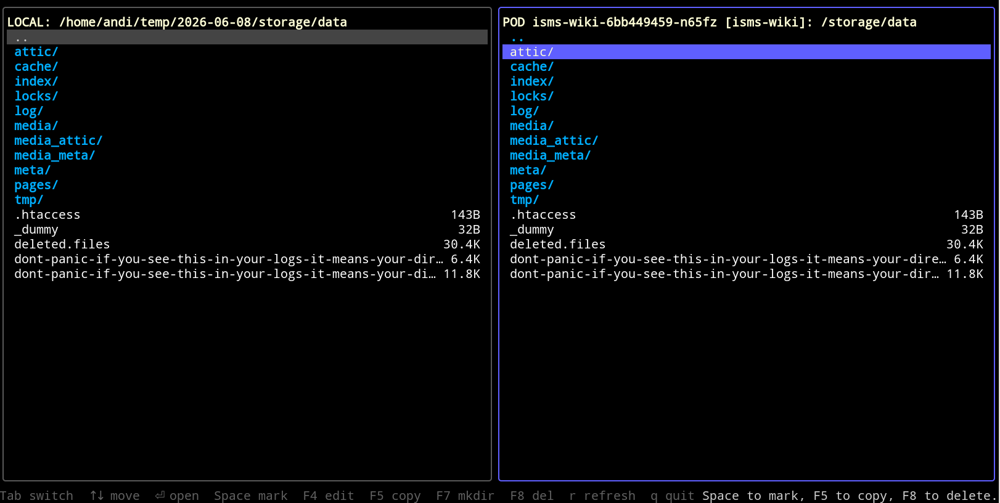

# k8tc

A two-panel terminal UI (Midnight Commander style) for transferring files
between your local machine and a Kubernetes pod. Transfers stream `tar` over
`kubectl exec`, so file **mode** bits and **mtime** are preserved.



## Requirements

- `kubectl` on your `PATH`, configured with a valid context.
- The target pod's container must have `tar` available (the standard busybox
  `tar` is fine). Distroless/scratch images without `tar` cannot be used for
  transfers — k8tc reports this clearly rather than hanging.
- A local `tar` (GNU or BSD).

## Install

```sh
CGO_ENABLED=0 go build -o k8tc ./cmd/k8tc
# or
make
```

Produces a single static binary.

## Usage

```sh
k8tc [--pod <name>] [flags]
```

Run `k8tc` with **no `--pod`** and it opens an interactive picker that drills
from context to namespace to pod: pick a context (skipped if you only have one),
then a namespace, then a pod (and a container, when a pod has more than one).
Type to filter the current list, `↑`/`↓` to move, `Enter` to descend/select,
`Esc` to clear the filter or back up a level (and to exit at the top), `Ctrl+C`
to quit. Pass flags to skip the picker steps.

Listing namespaces needs cluster-wide permission; on a restricted cluster where
`kubectl get namespaces` is refused, the picker falls back to a free-text
namespace field, prefilled with the namespace your kubeconfig sets for the
chosen context (if any).

| Flag                   | Meaning                                                        |
|------------------------|----------------------------------------------------------------|
| `--pod`                | Pod name. Omit to choose interactively.                       |
| `--context`            | Kube context (`kubectl --context`); default is the current one. |
| `--namespace`, `-n`    | Namespace (passed to `kubectl -n`).                           |
| `--container`, `-c`    | Container name (`kubectl exec -c`); omit for the default.     |
| `--remote-path`        | Initial remote directory (default `/`).                       |
| `--local-path`         | Initial local directory (default `.`).                        |
| `--preserve-ownership` | Attempt to restore owner UID/GID on extract. See below.       |

### Keybindings

| Key            | Action                                                        |
|----------------|---------------------------------------------------------------|
| `Tab`          | Switch focus between the local and remote panel               |
| `↑`/`↓`, `k`/`j` | Move the cursor                                             |
| `PgUp`/`PgDn`  | Page the cursor                                               |
| `Enter`        | Descend into a directory / ascend via `..`                    |
| `Space`/`Insert` | Mark/unmark the entry under the cursor and move down        |
| `F4` or `e`    | Edit the highlighted file in `$EDITOR` (round-trip via a temp copy) |
| `F5` or `c`    | Copy the marked entries (or the highlighted one) to the other panel |
| `F8` or `d`    | Delete the marked entries (or the highlighted one) from the focused panel |
| `r`            | Refresh the focused panel                                     |
| `q`, `Ctrl+C`  | Quit                                                          |

Mark one or more files/directories with `Space`, then press `F5` to copy them
from the **focused** panel into the **other** panel's current directory. If
nothing is marked, `F5` copies just the highlighted entry. Marks are scoped to a
directory: navigating away clears them.

`F5` first shows a **confirmation dialog** summarising what will be copied and
where. Once confirmed, a **progress dialog** reports the current item, item
count and bytes transferred, with `Esc` to **abort**. Aborting stops the queue
and leaves already-copied items in place (the partially-copied item is not
rolled back). Directory copies are recursive; transfers run asynchronously, so a
large transfer never freezes the UI.

`F8` deletes instead of copying, acting on the **focused** panel (marked entries,
or the highlighted one). It shows a **confirmation dialog** that spells out what
will be removed and from where.
**Deletes are recursive and cannot be undone**: a directory and everything under
it goes. Like copies, deletes run asynchronously with a progress dialog and `Esc`
to abort the remaining items; entries already removed stay removed.

`F4` edits the **highlighted file** (on either panel) in your `$EDITOR`. The file
is fetched to a private temporary directory — pulled from the pod, or copied
locally — and opened there; k8tc releases the terminal so the editor runs as
normal. When the editor exits, the working copy is written back to where it came
from **only if its modification time changed** — save and it's pushed back,
quit without saving and the original is left untouched. The temporary copy is
always cleaned up. `$EDITOR` may carry flags (e.g. `code --wait`); if it is
unset, `F4` reports that and does nothing. Directories and `..` are not editable.

## A note on ownership

Mode bits and mtime are preserved without any special privilege. **Owner
UID/GID is best-effort.** When `tar` extracts without `CAP_CHOWN` (a normal user
locally, or a rootless container), it silently creates files owned by the
extracting user rather than failing.

- By default k8tc extracts with `--no-same-owner` (mode + mtime preserved,
  ownership left to the extracting user). This is the sensible default in both
  directions — the pod's UID 1000 is not your UID, and a rootless pod can't
  chown anyway.
- `--preserve-ownership` extracts with `--same-owner --numeric-owner`. This only
  has an effect when the extracting end is **privileged** (root in the
  container, or root locally). Against a rootless target it degrades to the same
  best-effort behavior, so don't be surprised if UIDs don't carry across.

